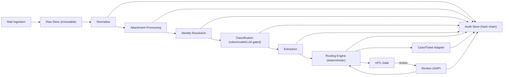

# Intake Routing Engine v1.0.5

Intake Routing Engine is an **open-source, self-hosted email intake and routing system**. It ingests inbound emails (with attachments), extracts structured facts, applies deterministic routing, and creates auditable downstream actions (case/ticket, drafts, or human review) with an immutable audit trail.

It turns inbound emails (including attachments) into **auditable, deterministic operational outcomes**:
ingest -> normalize -> attachment processing -> identity resolution -> classify/extract -> deterministic routing -> case/ticket actions -> HITL review (when needed) -> immutable audit log.

## Workflow (end-to-end)

Below is the concrete pipeline flow and what each stage produces. All stages emit append-only audit events.

1) Ingest
- Pulls email from M365 Graph, IMAP, or SMTP gateway.
- Stores raw MIME and attachments in append-only storage.
- Emits an audit event with raw artifact references and hashes.

2) Normalize
- Parses MIME into a schema-valid NormalizedMessage (subject/body/headers/threads).
- Canonicalizes text and detects language.
- Fails closed to review if parsing or schema validation fails.

3) Attachment processing
- AV scans and file type detection.
- Extracts text and runs OCR when needed.
- Stores derived text artifacts immutably with hashes.
- If malware is detected, routing is blocked and sent to security review.

4) Identity resolution
- Retrieves candidates via policy/claim/customer lookups.
- Scores candidates deterministically; selects only when thresholds and margins are met.
- If uncertain, status is NEEDS_REVIEW and a request-for-info draft is generated.

5) Classification and extraction
- Produces intents, product line, urgency, and risk flags, plus entities with evidence spans.
- LLM-first is supported but gated; invalid output fails closed.
- Deterministic rules and gates remain authoritative for high-impact risks.

6) Routing
- Applies deterministic routing rules with hard risk overrides first.
- If no rule matches or identity/product is unknown, routes to review.

7) Case/ticket or HITL
- Creates/updates cases and attaches originals when allowed.
- Otherwise routes to HITL review with evidence and draft suggestions.

8) Audit
- Every stage emits an AuditEvent with hashes, versions, and evidence spans.
- Audit logs are append-only and hash-chained for tamper detection.

## What you get

- Production-ready pipeline services (API, worker, scheduler) with fail-closed defaults.
- Docker Compose distributions (`starter` and `production`) and a Kubernetes Helm chart.
- Adapters and mocks for enterprise integration (mail ingest, identity directory, case/ticket).
- Human-in-the-loop (HITL) review API and minimal web UI.
- Binding quality gates, deterministic decision hashing, and an append-only audit hash chain.

This is not a hosted SaaS. You deploy it in your own environment (Compose or Kubernetes/Helm).

## Architecture

High-level pipeline and integration boundaries:



Details: `spec/02_ARCHITECTURE.md`

## Quickstart

From the repo root:

```bash
bash scripts/verify_pack.sh
python -B -m unittest discover -s tests -p "test_*.py"
```

Run locally with Docker Compose (starter):

```bash
docker compose -f deploy/compose/starter/docker-compose.yml up -d --build
python ieimctl.py demo run --config configs/dev.yaml --samples data/samples
docker compose -f deploy/compose/starter/docker-compose.yml down -v
```

## Design principles (product and compliance)

- **Fail-closed by default**: uncertainty routes to review or request-info drafts.
- **Immutability**: raw MIME/attachments are append-only; audit events are append-only with a hash chain.
- **Determinism mode**: reproducible decisions; decision hashes are timestamp-free.
- **Canonical contracts**: canonical labels/IDs and schema IDs are defined in `spec/00_CANONICAL.md` and enforced in CI.
- **Human-in-the-loop (HITL)**: reviewer actions are stored as versioned correction records and audited.

## Repository map (where to look)

- Canonical IDs and labels: `spec/00_CANONICAL.md`
- Scope and requirements: `spec/01_SCOPE.md`
- Phase plan and gates: `spec/09_PHASE_PLAN.md` and `QUALITY_GATES.md`
- Enterprise-ready roadmap (P9+): `spec/13_ENTERPRISE_PHASE_PLAN_P9_PLUS.md`
- Enterprise defaults (P9+): `spec/14_ENTERPRISE_DEFAULTS.md`
- Contracts (JSON Schemas): `schemas/`
- Interfaces (adapters and HITL): `interfaces/`
- Prompts and strict JSON contracts: `prompts/`
- Runbooks: `runbooks/` and `spec/11_OPERATIONS_RUNBOOK.md`
- Reference implementation: `ieim/` and `ieimctl.py`
- Verification scripts: `scripts/`
- Sample corpus + gold expectations: `data/samples/`

## Install

- Docker Compose: `docs/INSTALL_COMPOSE.md`
- Kubernetes/Helm: `docs/INSTALL_HELM.md`
- Upgrade guidance: `docs/UPGRADE.md`

## Releases (installable artifacts)

Each GitHub Release publishes:

- Helm chart package (`ieim-<version>.tgz`)
- SBOMs (SPDX JSON) for the published container images
- Signed provenance (`provenance.json` + `provenance.sig` + `provenance.crt`)

Release container images are published to GHCR:

- `ghcr.io/<owner>/ieim-api:<version>`
- `ghcr.io/<owner>/ieim-worker:<version>`
- `ghcr.io/<owner>/ieim-scheduler:<version>`

Details and verification: `docs/RELEASES.md`

## LLM usage (policy-gated)

LLM-first mode is supported and enabled by default in the provided configs. LLM calls remain gated to preserve
safety and reproducibility: determinism mode disables LLM, and the system fails closed to review when an LLM
output is invalid or below confidence thresholds. The default local provider is Ollama and can be switched to
OpenAI by changing `classification.llm.provider` in the config.

Details: `spec/05_CLASSIFICATION_AND_LLM.md`

## License

Apache-2.0 (see `LICENSE`).
