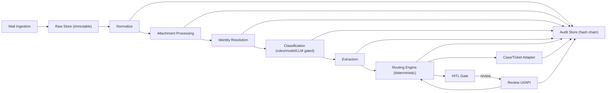
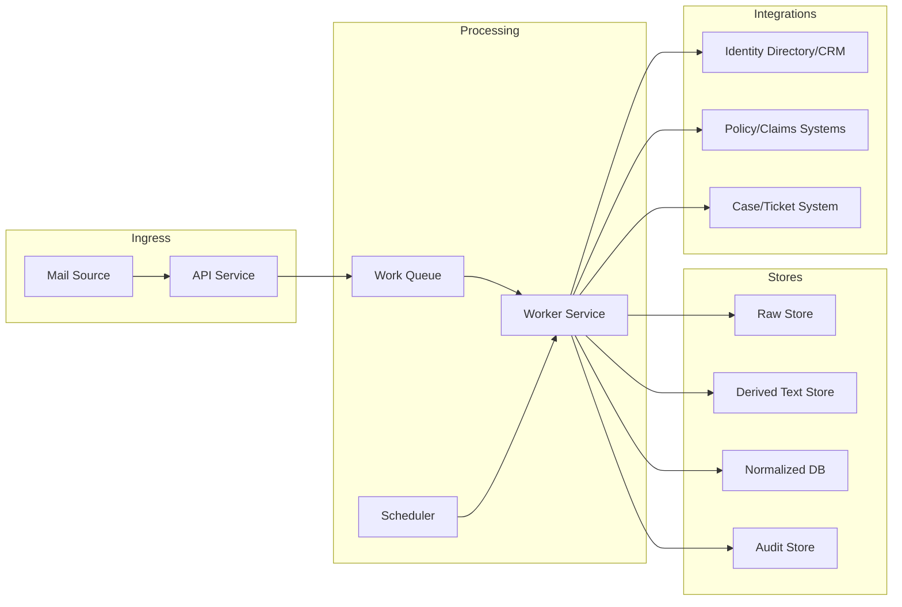

# Architecture

This section describes IEIM's logical and physical architecture, including data stores and integration points. Canonical IDs, labels, and paths are defined in `spec/00_CANONICAL.md`.

## End-to-end flow (logical)

## Runtime view (services + data paths)

## Component model

The system is decomposed into services and adapters. The module identifiers used for traceability are listed in `spec/00_CANONICAL.md`.

### Core services

| Service | Responsibilities | Notes |
|---|---|---|
| Ingestion service | Connectors for M365 Graph, IMAP, SMTP gateway; idempotent intake | At-least-once + dedupe |
| Raw store service | Append-only storage of MIME and attachment bytes | Never overwrite |
| Normalization service | MIME parsing, canonicalization, language detection, thread metadata | Produces NormalizedMessage |
| Attachment service | AV scan, file type detect, text extract, OCR | Produces AttachmentArtifact |
| Identity service | Candidate retrieval + deterministic scoring + Top-K + evidence | Fail-closed |
| Classification service | Rules -> lightweight model -> LLM (gated) | Strict JSON outputs |
| Extraction service | Entities + provenance + validation | High-impact entities gate |
| Routing service | Deterministic decision tables + hard overrides | Versioned rulesets |
| Case adapter service | Create/update cases, attach original email/files, add drafts | Idempotent keys |
| Audit logger | Append-only audit events + hash chain | Tamper-evident |
| Review UI/API | Human review, corrections, approvals | RBAC-gated |

### Stores

| Store | Contents | Immutability |
|---|---|---|
| Object storage (raw) | MIME and attachment bytes | Append-only (no overwrite) |
| Object storage (derived) | Extracted text artifacts and OCR output | Append-only, versioned by hashes |
| Normalized DB | NormalizedMessage and derived results | Mutable via versioned records; never rewrite raw |
| Audit store | AuditEvent append-only events with hash chain | Append-only |
| Cache | LLM result cache keyed by fingerprints and versions | TTL-based |

## Data contracts by stage

Each stage reads a schema-validated artifact and writes a schema-validated artifact. All outputs are immutable and hash-addressed.

| Stage | Input | Output | Schema |
|---|---|---|---|
| INGEST | raw MIME + attachments | raw artifacts + ingest metadata | `schemas/normalized_message.schema.json` (metadata) |
| NORMALIZE | raw MIME | NormalizedMessage | `schemas/normalized_message.schema.json` |
| ATTACHMENTS | attachments | AttachmentArtifact(s) | `schemas/attachment_artifact.schema.json` |
| IDENTITY | NormalizedMessage + text artifacts | IdentityResolutionResult | `schemas/identity_resolution_result.schema.json` |
| CLASSIFY | NormalizedMessage + identity context | ClassificationResult | `schemas/classification_result.schema.json` |
| EXTRACT | NormalizedMessage + attachments | ExtractionResult | `schemas/extraction_result.schema.json` |
| ROUTE | identity + classification | RoutingDecision | `schemas/routing_decision.schema.json` |
| AUDIT | stage input/output refs | AuditEvent | `schemas/audit_event.schema.json` |

## Determinism and reproducibility

- Determinism mode disables LLM calls and produces timestamp-free decision hashes.
- All decisions include config hash, ruleset version, and prompt/model versions where applicable.
- Reprocessing uses pinned artifacts; if any artifact is missing, it fails closed to review.

## Failure and safety gates

- Risk flags (malware, legal, regulatory, fraud, self-harm) override routing before normal rules.
- If identity cannot be confirmed or is ambiguous, route to review and generate a minimal request-for-info draft.
- If LLM output fails schema validation or confidence thresholds, the system fails closed to review or falls back to deterministic rules.

## Deployment variants

### On-prem
- All services and stores run within a controlled network zone.
- LLM use is either disabled or served by an on-prem model endpoint.

### Hybrid (recommended)
- Core pipeline and storage remain on-prem/private cloud.
- External LLM is optional and only enabled through a redaction/minimization gateway.

### Cloud
- Fully hosted in a single-tenant environment with private networking, customer-managed keys, and strict DLP.

Recommendation rationale: hybrid provides the best balance of compliance, model quality, and operational scalability while preserving a deterministic and review-safe fallback.

## Integration boundaries

- Mail ingestion adapter boundary: `interfaces/mail_ingest_adapter.md`
- Case/ticket system adapter boundary: `interfaces/case_system_adapter.md`
- Optional DMS/ECM adapter boundary: `interfaces/dms_adapter.md`

## Backpressure and failure handling

- The pipeline is event-driven. Each stage emits an audit event and produces a persisted output before acknowledging upstream work.
- When dependencies are unavailable, the system must either retry within policy or fail closed to a review queue.
